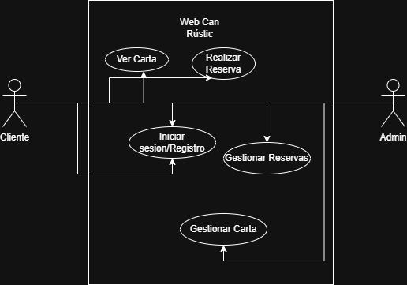
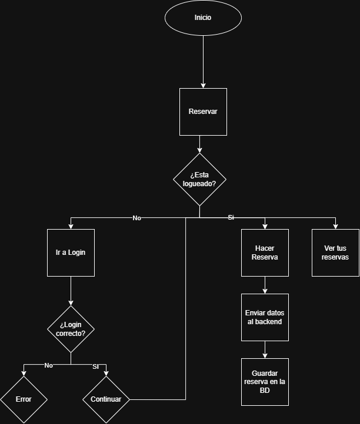

# Rustic Frontend

## Descripción

Este repositorio contiene el **frontend** de la aplicación Rustic.

El frontend está desarrollado con Angular y permite a los usuarios interactuar con la aplicación mediante una interfaz web. La aplicación se comunica con el backend mediante peticiones HTTP a una API REST.

Este proyecto forma parte de una aplicación web completa que utiliza un backend desarrollado con Node.js y una base de datos MongoDB.

---

## Tecnologías utilizadas

* Angular
* TypeScript
* HTML
* CSS
* Git

---

## Requisitos previos

Antes de ejecutar el proyecto es necesario tener instalado:

* Node.js
* npm
* Angular CLI

---

## Instalación

1. Clonar el repositorio

```bash
git clone https://github.com/marcmataa/frontend-rustic.git
```

2. Entrar en la carpeta del proyecto

```bash
cd frontend-rustic
```

3. Instalar dependencias

```bash
npm install
```

4. Ejecutar la aplicación

```bash
npm run start
```

La aplicación se ejecutará en:

```
http://localhost:4200
```

---

## Funcionalidades del frontend

* Interfaz de usuario de la aplicación
* Comunicación con la API del backend
* Visualización de datos
* Gestión de formularios
* Interacción con el usuario

---

## Estructura del proyecto

```
src/
 ├── app
 │   ├── components   # Componentes de la interfaz
 │   ├── services     # Servicios para comunicación con la API
 │   ├── pages        # Páginas de la aplicación
 │   └── app.module.ts
 ├── assets           # Imágenes y recursos
 ├── environments     # Configuración de entorno
 └── main.ts          # Punto de entrada de la aplicación
```

---

## Autor

**Marc Mata**

Desarrollo completo del proyecto:

* Frontend
* Backend
* Integración con base de datos

---

## División de tareas

| Miembro   | Tarea                      |
| --------- | -------------------------- |
| Marc Mata | Desarrollo del frontend    |
| Marc Mata | Desarrollo del backend     |
| Marc Mata | Conexión con base de datos |

---

## Control de versiones

Este proyecto utiliza Git para el control de versiones y está alojado en GitHub.

Repositorio frontend:
https://github.com/marcmataa/frontend-rustic

---

## Backend del proyecto

El backend de esta aplicación está desarrollado con Node.js y MongoDB.

Repositorio backend:
https://github.com/marcmataa/backend-rustic

---

## 📑 Documentación Técnica

### Diagrama de Casos de Uso


### Diagrama de Flujo


